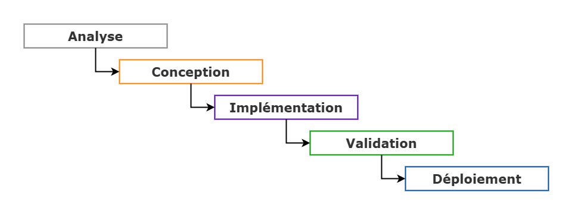

# Agile : Méthodologie

## Sommaire
1. [Introduction](#introduction)
    - [Disciplines du développement applicatif](#disciplines-du-développement-applicatif)
    - [Méthodologies différentes](#méthodologies-différentes)
1. [Framework](#framework)
    - [Les cadres Agile](#les-cadres-agile)
    - [Kanban](#kandban)
1. [Annexes](#annexes)
    - [Glossaire](#glossaire)
    - [Pour en savoir plus](#pour-en-savoir-plus)

---

## Introduction

Une méthodologie sert à établir un mode de fonctionnement pour structurer, planifier et contrôler le processus de développement d'un système d'information.

### Disciplines du développement applicatif

1. **Analyse des exigences** – _Business_ : comprendre les besoins du client
2. **Conception** – _Design_ : définir la solution technique
3. **Développement** : implémenter la solution
4. **Validation** – _Testing_ : contrôler l'adéquation des besoins et de la solution
5. **Déploiement** – _Deployment_ : intégrer et mettre en production
6. **Maintenance**

### Méthodologies différentes

Les différences entre les méthodologies résident essentiellement dans :
1. L'importance donnée à chaque activité
2. La séquence permise entre chaque activité

Il existe les méthodologies Waterfall, Spiral, Incrémental, Agile, etc.

#### 1️⃣ Waterfall

Introduit par Henry Ford au début du XXe siècle afin d'améliorer la productivité dans la chaine de construction automobile. Le "Fordisme" se veut séquentiel et les travailleurs dans chaque séquence sont spécialisés.

Depuis les années '70, le secteur de l'IT utilise la méthode "en cascade" où un livrable, un planning, etc. sont définis au début, et où chaque phase se succède l'une après l'autre.

**Avantages**
1. Approche simple : création du planning / du budget et suivi faciles
2. Économie : équipes de travail spécialisées pour chaque séquence
3. Pérennisation de la connsaissance : projet entièrement défini dès le départ et connu de toutes les parties

**Inconvénients**
1. Rigidité : anticipation d'imprévus et respect du planning / du budget difficiles
2. Effet tunnel : feedbacks tardifs du client
3. Livrable fixé : modification en cours de route et réadaptation des besoins impossibles
4. Mauvaise communication : les équipes ne travaillent pas ensemble constamment
5. Implication tardive des développeurs : conception du projet définie sans l'équipe
6. Risques tardifs : défauts levés seulement en fin de projet
7. Documentation pléthorique : tout doit être expliqué

**Exigences**
1. Claires et correctement définies
2. Environnement de travail stable
3. Technologie maitrisée
4. Aucune inconnue ni nouveauté
5. Expérience requise dans des projets similaires
6. Projet court de quelques mois

#### 2️⃣ Agile

Depuis les années 90, plusieurs méthodologies ont été créées pour améliorer le processus _Waterfall_, et augmenter la productivité et la qualité du travail dans le secteur IT.

Basé sur l'Empirisme : connaissance provient de l'expérience, les décisions sont prises sur ce qu'on sait.
1. Inspection : remise en question constante du projet et du process
2. Adaptation : modification des plans sur base de l'inspection
3. Transparence : partage d'informations nécessaires

**Incrémental et itératif**

- Incrémentation : Développement découpé en plusieures parties et chaque développement vient s'ajouter à l'existant.
- Itération : Récurence des feedbacks de toutes les parties sur la dernière incrémentation et sur l'ensemble du produit jusqu'à la fin.

**Avantages**
1. Communication : malentendus corrigés très tôt, clarification plus fréquente
2. Transparence : aperçu et preuves de l'avancement progressif du projet
3. Diminution des risques : tests, anomalies et corrections au fur et à mesure
4. Valorisation des coûts : revenus générés dès le début
5. Coûts contrôllés : décomposés et limités à l'itération elle-même, et interruplibles à tout moment
6. Apprentissage : leçons à chaque itération
7. Confiance progressive : des différentes parties

**Le manifest Agile**
- 4 valeurs : https://agilemanifesto.org/iso/fr/manifesto.html
- 12 principes : https://agilemanifesto.org/iso/fr/principles.html

**Philosophie**
- Agile n'est pas normatif mais descriptif de l'organisation
- Agile n'est pas exclusif mais adaptatif

---

## Framework

### Les cadres Agile

- Scrum
- Scrum / XP Hybrid
- Kandban
- Scrumban
- Extreme Programming (XP)
- Lean
- Agile Unified Process (AgileUP)
- Agile Modeling

### Kandban

Gestion du flux de travail et gestion de production en flux tendu (cf. Toyota). Production "Just-in-time", faire ce qui est nécessaire, quand c'est nécessaire et dans la quantité nécessaire.

**Principes**
1. Commencer par ce qu'on fait maintenant
2. Accepter de poursuivre un changement progressif et évolutif
3. Respecter le processus actuel, les rôles et les responsabilités
4. Encourager les actes de leadership à tous niveau 

#### 1️⃣ Tableau d'affichage

Visualiser le travail qui reste à faire, le travail terminé et le travail en cours. Chaque colonne identifie les étapes de travail : le Kanban d'une équipe est spécifique à l'équipe elle-même, c'est son _Workflow_.

<figure style="border: 1px solid #666; padding: 12px">
    
    <figcaption style="font-style:italic;">Kanban Elements, Jira / Atlassian - <a href="https://www.atlassian.com/fr/agile/kanban/boards" target="_blank" rel="noopener">Atlassian.com</a></figcaption>
</figure>

**Colonnes minimum**
- To do
- Doing
- Done

**Colonnes possibles**
- To Do
- Analysis
- Development
- Reviewing
- Testing
- Done

<figure style="border: 1px solid #666; padding: 12px">
    
    <figcaption style="font-style:italic;">Kanban Board, Jira / Atlassian - <a href="https://www.atlassian.com/fr/agile/kanban/boards" target="_blank" rel="noopener">Atlassian.com</a></figcaption>
</figure>

#### 2️⃣ Carte

Une carte est une tâche à faire qui n'est ni trop grande ni trop petite. 

Contenu par défaut
- Titre 
- Description
- Personne(s)
- Date limite
- Statut

<figure style="border: 1px solid #666; padding: 12px">
    
    <figcaption style="font-style:italic;">Kanban Card and WIP limit, Jira / Atlassian - <a href="https://www.atlassian.com/fr/agile/kanban/cards" target="_blank" rel="noopener">Atlassian.com</a></figcaption>
</figure>

#### 3️⃣ Cadre

**WIP limit**
Le _Work In Progress Limit_ est une règle quantitative du nombre de tâches simultanées par colonne. Dès que ce nombre est atteind, il faut treminer une tâche avant d'en commencer une autre.

**Cumulative Flow Diagram**
Une courbe – normalement – croissante représentant l'évolution du workflow. Permet d'identifier d'éventuels problèmes, les étapes les unes par rapport aux autres.

<figure style="border: 1px solid #666; padding: 12px">
    
    <figcaption style="font-style:italic;">Cumulative Flow Diagram, Nave - <a href="https://getnave.com/cumulative-flow-diagram-for-jira" target="_blank" rel="noopener">GetNave.com</a></figcaption>
</figure>

**Lead Time**
Le temps nécessaire pour qu'une tâche passe de la colone "To do" à la colonne "Done".

**Principes Kanban**
1. Commencez par ce que vous faites maintenant
2. Accepter de poursuivre un changement progressif et évolutif
3. Respecter le processus actuel, les rôles et les responsabilités
4. Encourager les actes de leadership à tous les niveaux

---
---

## Annexes

### Glossaire

### Pour en savoir plus

- [The Standish Group & the CHAOS Report](https://www.standishgroup.com/)
- [Le Coach Agile - Atlassian](https://www.atlassian.com/fr/agile)
- [Le manifest Agile - Atlassian](https://www.atlassian.com/fr/agile/manifesto)
- [Agile à grande échelle - Atlassian](https://www.atlassian.com/fr/agile/agile-at-scale)
- [Équipes Agile - Atlassian](https://www.atlassian.com/fr/agile/teams)
- [Kanban - Atlassian](https://www.atlassian.com/fr/agile/kanban)
- [Tutoriels Agile avec Jira et Confluence - Atlassian](https://www.atlassian.com/fr/agile/tutorials)
- [Conversation Agile - Atlassian](https://www.atlassian.com/fr/agile/agile-conversations)