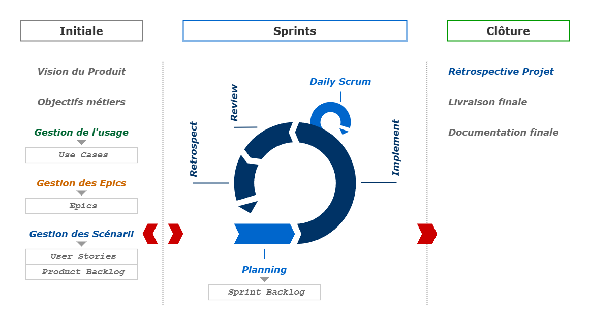

# Agile : Scrum

## Sommaire 
1. [Description](#description)
    - [Cycle de vie](#cycle-de-vie)
1. [Rôles](#role)
    - [Product Owner](#product-owner)
    - [Scrum Master](#scrum-master)
    - [Scrum Team](#scrum-team)
    - [Rôles connexes](#rôles-connexes)
1. [Meetings](#meetings)
    - [Sprint Planning](#sprint-planning)
    - [Daily Scrum](#daily-scrum)
    - [Sprint Review](#sprint-review)
    - [Sprint Retrospective](#sprint-retrospective)
1. [Composantes](#composantes)
    - [User Story](#user-story)
    - [Product Backlog](#product-backlog)
    - [Story Point](#story-point)
    - [Release](#release)
1. [Annexes](#annexes)
    - [Glossaire](#glossaire)
    - [Pour en savoir plus](#pour-en-savoir-plus)


---


## Description

> **Scrum Guide :**
> A framework within which people can address complex adaptive problems, while productively and creatively delivering products of the highest possible value

- Agile : la méthodologie (philosophie)
- Scrum : le framwork (cadre)

Scrum est un framework d'Agile. En 1 _Sprint_ (pédiode de 1 à 4 semaines), on produit une version fonctionnelle de l'application. 
La structure du framwork en 3 étapes
1. On définit les exigences et les priorités dans le _Product Backlog_
2. L'équipe _Scrum_ s'auto-organise durant le _Sprint_
3. On décide de livrer le produit en l'état ou de continuer à l'améliorer 

Le "process" d'une équipe est le résultat du framework Scrum adapté à l'environnement dans lequel il est exploité.


### Cycle de vie

Le processus d'un projet Scrum comprend 3 phases
1. La phase Initiale
    - Analyse produit
    - Création d'un _Product Backlog_
2. La phase de _Sprints_
    - Développements
    - Création d’un _Sprint Backlog_
3. La phase de Clôture
    - Préparation de la livraison


#### Phase Initiale

- Conceptualiser et analyser le système à concevoir
- Mettre en place une liste de tâches, un _Product Backlog_
- Définir une date de livraison (approximative)
- Constituer une équipe de développement
- Analyser les risques et les coûts

L'ensemble des parties doit contribuer à cette phase qui requière diverses connaissances : connaissance du marché, connaissance des utilisateurs finaux, connaissance techniques, maturité des projets similaires précédents.


#### Phase de Sprints

- Procéder au développement à travers des périodes courtes, des _Sprints_
    - Analyse de cas d'usage
    - établissement de fonctionnalités
    - implémentations
    - tests fonctionnels
    - etc.
- Définir les tâches pour le _Sprint_, un _Sprint Backlog_, issues du _Product Backlog_
- Identification des difficultés et améliorations


#### Phase de Clôture

- Intégrer le système
- Procéder aux tests systèmes
- Rédiger la documentation usagers
- Préparer les supports de formation (guides)
- Préparer les supports marketing et promotion
- Préparer les comptes rendus, rapports, etc.


#### Schéma




---


## Rôles

**3 rôles clés**
- Product Owner
- Scrum Master
- Scrum Team

### Product Owner

Définit et transmet la vision globale du produit
- Responsable de la gestion du _Product Backlog_
- Faciliter la compréhension du _Product Backlog_ par toutes les parties
- Valoriser le travail fourni par l'équipe

Il ne peut y avoir qu'un PO par projet, pour n'avoir qu'un seul "référent" et qu'une seule "Vision" (sagesse). 
Lequel doit être "Leader"(communication) et "Team Player" (négociation). Et se doit d'être Visionnaire, Disponible et Qualifié.

#### Compétences

1. _Product Management_
    - Définir et communiquer la vision du Produit
    - Définir la stratégie de livraison des différentes versions du produit sur le marché
2. _Business Analysis_
    - Identifier les besoins et les exigences des utilisateurs
    - Mettre à jour du _Product Backlog_ pour refléter ces besoins et ces exigences
3. _Project Management_
    - Gérer le budget du projet
    - Contrôler le respect de chaque échéance

#### Champ d'action

Le _Product Owner_ fait partie de l'équipe Scrum Team et être sur place mais ne peut pas cummuler un autre rôle
- _Product Owner_ : responsable du "Quoi"
- _Scrum Master_ : responsable du "Comment"

Un _Product Owner_ est un rôle à plein temps. Il peut être attaché à 2 Scrum Teams seulement si 
- les deux _Scrum Teams_ travaillent sur le même produit
- les deux _Scrum Teams_ travaillent dans le même domaine
- les deux _Scrum Teams_ ont de l'expérience avec _Scrum_
Par exemple : deux équipes sont dispatchées respectivement sur le développement et sur la maintenance.


#### Risques à éviter

- Limiter les pouvoirs du _Product Owner_ : il ne dispose pas assez d'autonomie
- Surcharger le _Product Owner_ : il risque de se focaliser ce sur quoi il sera jugé, à savoir le _Project Management_ et de négliger l'aspet _Business Analysis_
- Ne pas séparer (transversalement) les tâches du _Product Owner_ entre différentes personnes

**Chief Product Owner**
Le CPO est introduit lorsque un PO ne peut pas s'occuper de deux _Scrum Teams_ ou lorsqu'un produit est trop volumineux et doit être décomposé en plusieurs "sous-produit". 
Il est alors responsable de :
- coordonner différents _Product Owners_
- la vision du produit


### Scrum Master

S'assure que la _Scrum Team_ fonctionne aussi efficacement que possible en respectant les règles du Framework _Scrum_.
- Aide l'équipe à travailler de façon autonome et à s'améliorer constamment
- Anime les réunions de Pré-Sprint, Scrum, Post-Sprint
- Elimine les obstacles qui ralentissent l'équipe
- Communique avec le management (ex. rapports d'avancement)

#### Compétences

1. _Développement_
    - Intégrer auprès de ses collègues
    - Connaitre les processus de développement
2. _Testing_
    - Comprendre pleinement le projet
    - Adopter les relations "1-to-1" avec chaque membre de l'équipe
    - Analyser les bugs et les erreurs de développement
3. _Project Management_
    - Organiser et coordonner
    - Bonne relation avec toute l'organisation
    - Éviter les habitudes autoritaires

#### Champ d'action

Le _Scrum Master_ n'est pas un chef d'équipe ni un chef de projet. Ce n'est pas la _Scrum Team_ qui est aux services du Scrum Master mais l'inverse.
Il ne dirige pas, il n'impose pas, il n'est pas craint
- Il fait partie de l'équipe
- Il aide l'équipe à mieux travailler
- Ceux qui font le travail sont les mieux placés pour déterminer comment faire le travail

#### Organisation

Soit _Full-time Dedicated_ : temps plein sur une seule équipe
- Permet d’être focus sur le projet
- Permet un suivi plus approfondi de l’équipe

Soit _Full-time Shared_ : temps partagé entre 2 ou 3 équipes
- Permet de répartir le coût d’un _Scrum Master_ entre plusieurs équipes

Soit _Part-time_ : temps partiel sur une seule équipe
- Plus proche des problématiques de l’équipe
- Idéal pour une équipe Scrum débutante


### Scrum Team

Responsable du déroulement de chaque _Sprint_, donc de tout ce qui est mis en oeuvre pour atteindre les objectifs.
L'équipe est impliquée dans 
- l'estimation de la charge de travail
- la création du _Sprint Backlog_
- l'identification des freins à l'avancement du projet

Le _Scrum Team_ comprend entre 3 et 9 membre afin de faciliter communication, de maintenir l'unicité de l'équipe et d'éviter la création de "sous-équipes". Un nombre restreint de membres laisse l'occasion à chacun de prendre des initiatives, de communiquer face-à-face, et de réussir ou échouer en "tant qu'équipe".


#### Auto-organisée

- Tirer avantage de la connaissance et l'expérience de chaque membre
- S'engager vis-à-vis des objectifs du sprint
- Identifier ses tâches
- Estimer l'effort nécessaire à chaque tâche
- Se focaliser sur la communication et la collaboration
- Prendr des décisions sur base de consensus
- Participer activement

#### Auto-gérée

- Contrôler la manière dont elle travaille pour assurer la réussine du projet
- Autoriser la fluctuation du leadership
- S'appuier sur les outils et processus Agile
- Rapporter régulièrement et de manière transparente l'avancement du projet
- Règler les problèmes au sein de l’équipe
- Créer une convention d'équipe
- S'instrospecter et s'adapter

#### Pluri-disciplinaire

- Avoir de la curiosité
- Contribuer au delà de sa zone de maîtrise
- Apprendre de nouvelles compétences
- Partager sa connaissance

#### First Among Equals

La _Scrum Team_ est autonome, ce qui permet au _Product Owner_ et au _Scrum Master_ de se focaliser sur le travail et non pas sur la gestion de l'équipe. 

Le _Product Owner_ est considéré comme "Firts Among Equals" (premier parmis ses pairs), il a le dernier mot en cas de désacord puisqu'il maitrise le produit et sa vision globale.


### Rôles connexes

**Management**
- Responsable de la décision finale
- Impliqué dans le choix du Product Owner
- Surveille l'avancement du projet
- Augmente ou réduir le _Spint Backlog_ en concertation avec le _Product Owner_ 

**Client**
- Participe à l'élaboration du _Product Backlog_
- Inspecte et valide chaque développement


---


## Meetings

4 types de réunion :
1. _Sprint Planning Meeting_ : Planification des tâches du _Sprint_, conduite en début de chaque _Sprint_
2. _Daily Scrum_ : Informelle de toute l'équipe, conduite quotidiennement
3. _Sprint Review_ : Présentation aux clients du travail effectué, conduite en fin de _Sprint_
4. _Sprint Retrospective_ : Évaluation de l'efficacité du _Sprint_, conduite en fin de _Sprint_


### Sprint Planning

Réunion de pré-Sprint organisée par le _Scrum Master_ et conduite en deux temps
1. Dresser un _Sprint Backlog_
    - Décider des objectifs et des fonctionnalités du prochain Sprint
    - Par les clients, utilisateurs, le management, _Product Owner_ et la _Scrum Team_
2. Organiser le Sprint
    - Décider de la manière dont l'incrément du produit sera mis en oeuvre 
    - Par le _Scrum Master_ et la _Scrum Team_

Durée : 2h. par semaine de Sprint.


### Daily Scrum

Réunion quotidienne informelle avec toute l'équipe. Elle se produit toujours au même endroit et à la même heure. Seul les personnes qui travaillent sur le développement peuvent intervenir. Les personnes extérieures n'y sont invitées que pour suivre l'avancement du projet.

Le but est de :
- partager les connaissances acquises
- faire un point sur l'avancement
- visibiliser la progressioon du projet auprès du Management
- faire un contrôle empirique via 3 questions
    1. Qu'est ce qui a été fait ?
    2. Que reste-t-il à faire ?
    3. Quels sont les obstacles à l'avancement du projet ?

Le _Scrum Master_ prend les décisions que l'équipe est incapable de prendre par elle même et s'engage à apporter une solution à tout ce qui entrave le développement du projet.

Durée : de 15 à 30 minutes.


### Sprint Review

Réunion informelle où la _Scrum Team_ présente au client ce qui a été développé.

Le but est de :
- Confronter les résultats du travail de l'équipe avec la complexité et le chaos de l'environnement dans lequel l'application sera utilisée
- Décider de faire une Release ou non

Durée : 1h. par semaine de Sprint.


### Sprint Retrospective

Réunion d'introspective ayant lieu après le _Sprint Review_ et avant le _Sprint Planning Meeting_.

Le but est de :
- Inspecter la manière dont s'est déroulé le Sprint précédent : relations, processus, outils
- Identifier et ordonner les éléments majeurs qui se sont déroulés ainsi que les améliorations potentielles
- Créer un plan pour implémenter des améliorations quant à la manière de travailler de l'équipe _Scrum_.

Durée : 45 minutes par semaine de Sprint.


---


## Composantes

### User Story

Les élements du _Product Backlog_ sont des _User Stories_, lesquelles sont rédigées selon le pattern
```
En tant que [rôle], je veux [action] afin de [but]
```
Exemple
```
En tant qu'utilisateur qui ferme l'application,
Je voudrais être invité à enregistrer tout ce qui a changé depuis la dernière sauvegarde 
Afin de pouvoir conserver le travail utile et de supprimer le travail erroné
```

Habituellement, les US sont établies lors de Workshops d'écriture par le _Product Owner_ (Business Analyst), avec les utilisateurs et éventuellement la _Scrum Team_. Elles suivent l'évolution des besoins usagers et ne sont pas forcément rythmées par les périodes de Sprint.

**But**
1. Susciter la communication
1. Faciliter la compréhension par toutes les parties
1. Taille appropriée pour la plannification
1. Format adéquat pour un processus itératif

**Bonnes pratiques**
1. Écrire pour un seul utilisateur
1. Écrire à la forme active
1. Ne pas numéroter les cartes
1. Écrire des User Stories fermées

**Spécificités**
- Critères INVEST
- Stratégie de décomposition
- Testabilité
- Definition of Done

> **N/B :**
> Ces spécificités sont relatées dans la section [Analyse > Utiles > User Stories]() du présent support de cours.


### Product Backlog

Une liste de tous les éléments nécessaires à la bonne livraison du produit.

Le Product Owner est responsable de la création et du suivi du bon déroulement de cette liste.

Tout membre de l'équipe Scrum peut ajouter des éléments à la liste en collaboration avec le Product Owner.

**Qualités DEEP**

1. Detailed Appropriately
    - Les éléments hautement prioritaires sont décomposés et raffinés en vue de la réunion du planning de Sprint (Detailed Appropriately)
2. Estimated
    - Estimation des éléments via le planning poker
3. Emergent
    - Ajout, modification, suppression d'éléments
4. Prioritized
    - Prioritisation (plus important en haut)

**Modèles**
- KANO
    - Must-Be
    - One-Dimensional
    - Attractive
    - Indifferent
    - Reverse
- MoSCoW – Les "o" n'ont aucune signification et sont ajoutés uniquement pour rendre l'acronyme prononçable
    - Must
    - Should
    - Could
    - Won't
- Now-How-Wow Matrix
- Modèle Volere

> **N/B :**
> Cette partie est détaillée dans la section [Analyse > Utiles > Produit]() du présent support de cours.


### Story Point

Sert à connaître la charge de travail aide à donner des priorités aux éléments. L'estimation est grossière et exprimée en nombre _Story Points_.

Un _Story Point_ correspond à une une unité relative, et non pas à une unité de temps précise : c'est le poids d'une tâche en comparaison à une autre

Les estimations sont réalisées par les membres de la _Scrum Team_. Le _Product Owner_ et le _Scrum Master_ ne doivent ni participer, ni influencer l'estimation.

Les _Story Points_ sont des nombres de la Suite de Fibonacci – suite d'entiers dans laquelle chaque terme est la somme des deux termes qui le précèdent, par ex. : 0, 1, 1, 2, 3, 5, 8, 13, 21, etc.


#### Estimation CURSE

Le concept de _Story Point_ est un défis pour les équipes qui adoptent Scrum – ou une autre méthodologie Agile.

Généralement les équipes assimilent ces points à une journée, or c'est incomplet et trompeur. La méthode CURSE sert à l'évaluation du poids d'une _User Story_.

**C - Complexity**
La complexité, l'implication, l'intégration, etc. du travail d'une histoire.

**U - Uncertainty**
L'incertitude du travail à effectuer. L'équipe peut manquer d'expérience sur une technologie, ou ignorer l'impact d'un élément de l'US sur l'architecture ou la conception.

**R - Risk**
Englobe le degré de dangerosité d'un changement ou d'une amélioration demandé pour l'ensemble du système, de la conception ou de l'architecture.

**S - Scope**
L'ampleur, la portée est la quantité de travail ou l'ampleur des changements particuliers.

**E - Effort**
Associé globalement aux _Story Points_. Cela représente le travail réel qui va être fait, la mise en oeuvre de l'US.


#### Planning Poker

Réussir à générer des estimations acceptables le plus rapidement possible.

1. Le _Product Owner_ présente la _User Story_. Pas de technique, uniquement l'aspect fonctionnel
2. La _Scrum Team_ demande des éclaircissements si besoin
3. La _Scrum Team_ estime et vote pour un nombre de _Story Points_
4. En cas de désaccord, on demande aux plus basses valeurs et plus hautes valeurs de justifier leur choix
    - Objectif : lancer la discussion
    - Chaque discussion est dans une time-box. Toutes les x minutes, on revote jusqu’à ce qu’on ait un accord.
5. À la fin, les éléments de même taille sont rassemblés pour valider leur valeur relative (triangulation)

**Bonnes pratiques**
1. Time-box : spécifier un intervalle de temps par tour de table (par ex. : 2 min.) et le chronométrer
2. Ne pas influencer l'estimation avec des "Je pense que ce sera vite fait" ou Ça risque de prendre des semaines… si pas des mois"
3. Ne jamais fixer son estimation tant que tous les autres membres n'ont pas estimé
4. Toujours obtenir un consensus plutôt qu'une moyenne
5. Ceux qui votent sont ceux qui feront le boulot, le _Product Owner_ et le _Scrum Master_ ne vote donc pas.


### Release

La planification d'une release représente :
1. Un outil d'aide à la décision
2. Un outil de pilotage
3. Un support de communication

**5 niveaux de planification**
1. Etablissement de la vision : la livraison finale
2. Etablissement d'un roadmap : les différentes releases
3. Planification d'une release : les différents Sprint aboutissant à la release
4. Planification d'un Sprint : les différentes _User Stories_ à réaliser durant l'itération
5. Réajustement du planning


#### Burndown Chart

Représentation graphique de l'évolution de quantité de travail restante par rapport au temps sur une période de temps donnée.
- Axe verticale : quantité de travail restant, total des _Story Points_
- Axe horizontale : temps restant, total de _Sprints_

Un _Burndown Chart_ peut être établi par projet ou par Sprint.

<figure style="border: 1px solid #666; padding: 12px">
    
    <figcaption style="font-style:italic;">Burndown Chart - <a href="https://fr.wikipedia.org/wiki/Burndown_chart" target="_blank" rel="noopener">Wikipédia</a></figcaption>
</figure>


#### Estimations

**Durée d'un Sprint**
- Entre 1 et 4 semaines
- Un Sprint court est plus facile, réduit les risques, mais engendre plus de réunions
- Un Sprint long est plus difficile, augmente les risques, mais engendre moins de réunions

Le principe de vélocité (v) est une valeur hypothétique établie au début du projet et qui s'affine au fur et à mesure des itérations. C'est la somme des _Story Points_ qu'une équipe est capable de développer durant une itération.

Après une première itération, on peut estimer une durée réaliste du projet.

**Dates des releases**
1. Temps : la date de lancement est-elle fixe ?
2. Coûts : le budget de développement est-il fixe ?
3. Fonctionnalités : quel niveau de fonctionnalité atteindre pour une release ?

Fixer ces trois variables est impossible.

> **N/B :**
> Ces spécificités sont relatées dans la section [Analyse > Utiles > Projet]() du présent support de cours.


---
---


## Annexes

### Glossaire

### Pour en savoir plus

- [Scrum - Atlassian](https://www.atlassian.com/fr/agile/scrum)
- [Gestion de projets Agile - Atlassian](https://www.atlassian.com/fr/agile/project-management)
