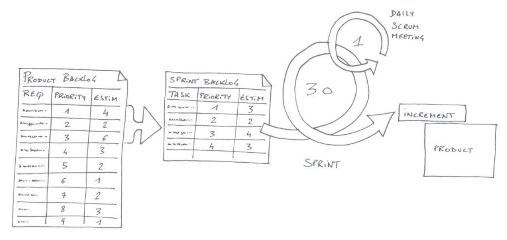

# Agile : Scrum Product Backlog

## Sommaire 
1. [Description](#description)
    - [Qualités DEEP](#qualite-deep)
1. [Approches de priorisation](#approches-de-priorisation)
    - [Modèle Kano](#modele-kano)
    - [Modèle MoSCoW](#modele-moscow)
    - [Matrice Now How Wow](#matrice-now-how-wow)
    - [Modèle Volere](#modele-volere)
1. [Analyse du risque](#analyse-du-risque)
    - [Exigence non-fonctionnelles](#exigences-non-fonctionnelles)


---


## Description

Une liste de tous les éléments nécessaires à la bonne livraison du produit.

Le _Product Owner_ est responsable de la création et du suivi du bon déroulement de cette liste.

Tout membre de la _Scrum Team_ peut ajouter des éléments à la liste en collaboration avec le _Product Owner_.




### Qualités DEEP

4 qualités essentielles d'un _Product Backlog_ :
1. **Detailed Appropriately**
    - Les éléments hautement prioritaires sont décomposés et raffinés en vue de la réunion du planning de Sprint (Detailed Appropriately)
2. **Estimated**
    - Estimation des éléments via le planning poker
3. **Emergent**
    - Ajout, modification, suppression d'éléments
4. **Prioritized**
    - Prioritisation (plus important en haut)


#### 1️⃣ **D :** Detailed approptiately

Les éléments les plus prioritaires sont les éléments les plus détaillés.
Implique que les exigences soient décomposées et raffinées durant l'entièreté du projet.

Les élements du _Product Backlog_ sont des _User Stories_, lesquelles sont rédigées selon le pattern
```
En tant que [rôle], je veux [action] afin de [but]
```
Exemple
```
En tant qu'utilisateur qui ferme l'application,
Je voudrais être invité à enregistrer tout ce qui a changé depuis la dernière sauvegarde 
Afin de pouvoir conserver le travail utile et de supprimer le travail erroné
```

Habituellement, les US sont établies lors de Workshops d'écriture par le _Product Owner_ (en tant que Business Analyst), avec les utilisateurs et éventuellement la _Scrum Team_. Elles suivent l'évolution des besoins usagers et ne sont pas forcément rythmées par les périodes de Sprint.

**But**
1. Susciter la communication
1. Faciliter la compréhension par toutes les parties
1. Taille appropriée pour la plannification
1. Format adéquat pour un processus itératif

**Bonnes pratiques**
1. Écrire pour un seul utilisateur
1. Écrire à la forme active
1. Ne pas numéroter les cartes
1. Écrire des User Stories fermées

**Spécificités**
- Critères INVEST
- Stratégie de décomposition
- Testabilité
- Definition of Done


> **N/B :**
> Cette partie est détaillée dans la section [Analyse > Utiles > Cas d'utilisation et Scénario]() du présent support de cours.


#### 2️⃣ **E :** Estimated 

Connaître la charge de travail aide à donner des priorités aux éléments.

**Story Point**

Sert à connaître la charge de travail aide à donner des priorités aux éléments. L'estimation est grossière et exprimée en nombre _Story Points_.

Un _Story Point_ correspond à une une unité relative, et non pas à une unité de temps précise : c'est le “poids” (le “temps”) d'une tâche en comparaison à une autre.

Les estimations sont réalisées par les membres de la _Scrum Team_. Le _Product Owner_ et le _Scrum Master_ ne doivent ni participer, ni influencer l'estimation.

Les _Story Points_ sont des nombres de la Suite de Fibonacci – suite d'entiers dans laquelle chaque terme est la somme des deux termes qui le précèdent, par ex. : 0, 1, 1, 2, 3, 5, 8, 13, 21, etc.


**Estimation CURSE**

Généralement les équipes assimilent les _Story Points_ à une journée, or c'est incomplet et trompeur. La méthode CURSE sert à l'évaluation du poids d'une _User Story_.

- **C** _Complexity_ : La complexité, l'implication, l'intégration, etc. du travail d'une histoire.
- **U** _Uncertainty_ : L'incertitude du travail à effectuer. L'équipe peut manquer d'expérience sur une technologie, ou ignorer l'impact d'un élément de l'US sur l'architecture ou la conception.
- **R** _Risk_ : Englobe le degré de dangerosité d'un changement ou d'une amélioration demandé pour l'ensemble du système, de la conception ou de l'architecture.
- **S** _Scope_ : L'ampleur, la portée est la quantité de travail ou l'ampleur des changements particuliers.
- **E** _Effort_ : Associé globalement aux _Story Points_. Cela représente le travail réel qui va être fait, la mise en oeuvre de l'US.


**Planning Poker**

Réussir à générer des estimations acceptables le plus rapidement possible.

1. Le _Product Owner_ présente la _User Story_. Pas de technique, uniquement l'aspect fonctionnel
2. La _Scrum Team_ demande des éclaircissements si besoin
3. La _Scrum Team_ estime et vote pour un nombre de _Story Points_
4. En cas de désaccord, on demande aux plus basses valeurs et plus hautes valeurs de justifier leur choix
    - Objectif : lancer la discussion
    - Chaque discussion est dans une time-box. Toutes les x minutes, on revote jusqu’à ce qu’on ait un accord.
5. À la fin, les éléments de même taille sont rassemblés pour valider leur valeur relative (triangulation)

Bonnes pratiques :
1. Time-box : spécifier un intervalle de temps par tour de table (par ex. : 2 min.) et le chronométrer
2. Ne pas influencer l'estimation avec des "Je pense que ce sera vite fait" ou Ça risque de prendre des semaines… si pas des mois"
3. Ne jamais fixer son estimation tant que tous les autres membres n'ont pas estimé
4. Toujours obtenir un consensus plutôt qu'une moyenne
5. Ceux qui votent sont ceux qui feront le boulot, le _Product Owner_ et le _Scrum Master_ ne vote donc pas.


#### 3️⃣ **E :** Emergent

Le contenu du product backlog change continuellement :
- De nouveaux éléments sont ajoutés
- Des éléments sont modifiés
- Des éléments sont supprimés


#### 4️⃣ **P :** Prioritized

1. Valeur apportée aux clients / utilisateurs
    - "Quel est le bénéfice financier à développer cette fonctionnalité ?"
2. Coût de développement estimé
    - "Quel est le coût de développement ? De maintenance ? De formation des utilisateurs ?"
    - "Quel est le coût d'un changement ?"
3. Opportunité d'apprentissage pour l'équipe
    - "L'implémentation de cette fonctionnalité nous permet-elle d'apprendre ou de développer de nouvelles compétences ?"
    - "Cette fonctionnalité va-t-elle améliorer la productivité de mon personnel ?"

Face à un nombre important d'exigences élicitées, à des ressources limitées et à l'impossibilité de faire tout / tout de suite, il donner un ordre de priorité à chaque US.

**Approche Qualitative**
- MoSCoW
- Kano Model
- Now-How-Wow Matrix

**Approche Quantitative**
- Matrix Prioritization / VOLERE


---


## Approches de priorisation

### Modèle Kano

Le succès d'un produit ou service dépend de sa capacité à résoudre efficacement un ou plusieurs problèmes des clients.
Toutes ces exigences ne vont pas donner la même satisfaction aux clients.
Le modèle Kano est une représentation des besoins en 5 catégories principales en fonction de la satisfaction qu'ils procurent.

Kano a identifié cinq catégories différentes de produits basées sur la perception du client.


**Must-Be**
- Ce que le client prend pour acquis. 
- Cost of entry pour pouvoir lancer le système

**One-Dimensional**
- Ce que le client exige explicitement, et souhaite voir vérifié dans la solution finale.
- Engendre une augmentation proportionnelle de satisfaction

**Attractive**
- Ce que le client n'exige pas forcément, mais apprécie fortement.
- Engendre une augmentation non proportionnelle de satisfaction.

**Indifferent**
- Ce que le client n'exige pas forcément, et ne souhaite spécialement voir vérifié dans la solution finale.
- N'engendre pas d'augmentation de la satisfaction.

**Reverse**
- Ce que le client souhaite voir être évité dans la solution finale.
- Engendre une diminution proportionnelle de la satisfaction.


### Modèle MoSCoW

Technique de priorisation sur base d'une échelle nominale (pas de chiffres).
Extrêmement fréquente car simple et multi-contexte.
Elle se base sur 4 grandes catégories
1. Must
2. Should
3. Could
4. Won't

> **N/B :**
> Les "o" n'ont aucune signification, ils sont ajoutés uniquement pour rendre l'acronyme prononçable.


**Must Have**
Les choses que le système doit vérifier afin d'aller de l'avant.

Si vous demandez à un client “Quid si X est manquant ?” et que la réponse est “Dans ce cas nous ne continuons pas”, alors vous avez trouvé un “must”.
Exemple, si :
- Livrer à une date sans X n'a aucun sens.
- Livrer sans X n'est pas légal.
- Livrer sans X n'est pas sûr (risque).

**Should Have**
- Diffère du Must Have dans le sens où il n'est pas absolument nécessaire pour aller de l'avant dans le projet, mais son absence entraînerait un niveau plus élevé d'insatisfaction de la part du client.
- Important mais pas vital.
- Peut être dommageable pour l'ensemble de laisser de côté, mais la solution est encore viable.
- Peut nécessiter une sorte de solution de contournement, par exemple gestion des attentes,
- etc.

**Could Have**
- Les éléments qui sont souhaitables, mais qui ont un impact plus faible si on les laisse sortir du scope du projet.
- Recherché ou souhaitable, mais moins important.
- Moins d'impact si laissé de côté (par rapport à Should).

**Won't Have**
- Les éléments identifiés comme étant souhaitables ou précieux, mais qui ne sont pas assez importants pour être implémentés dans le prochain release.
- Ils ne sont pas invalides : ils sont tout simplement des éléments à ne pas prendre en compte "pour le moment”.


### Matrice Now-How-Wow

Les idées créatives ne sont pas forcément les plus difficiles à mettre en oeuvre. Certaines offrent une valeur ajoutée très importante pour un coût relativement faible.

Now-How-Wow aide à sélectionner et prioriser les idées selon leur faisabilité et leur degré d'innovation.

<figure style="border: 1px solid #666; padding: 12px">
    
    <figcaption style="font-style:italic;">Now How Wow Matrix - <a href="https://gamestorming.com/how-now-wow-matrix/" target="_blank" rel="noopener">Gamestorming</a></figcaption>
</figure>


### Modèle Volere

[Guide to Volere - Medium (account required)](https://medium.com/@bragadeeshs/mastering-the-art-of-requirements-an-in-depth-guide-to-volere-methodology-56133fe7a607)


---
---


## Analyse du risque

**Risque de développement**
- "Cette fonctionnalité nous expose-t-elle à davantage de risques ?" Ou, au contraire, "Nous permet-elle de nous confronter au risque ?"
- "Cette fonctionnalité va-t-elle impacter les processus métier ?"
- "Cette fonctionnalité va-t-elle susciter de la frustration ou de la résistance ?"
- "Quel est le préjudice si cette fonctionnalité n'est pas implémentée ?"


### Exigences non-fonctionnelles

Elle visent la performance, la robustesse, l'utilisabilité, etc.

Influence :
- l'interface utilisateur
- l'architecture
- les choix technologiques

Les exigences non-fonctionnelles sont décrites sous forme de contraintes. Par exemple : "Le système doit pouvoir répondre à n'importe quelle requête en moins d'une seconde".

Elles distinguent des exigences globales et locales
- Globales : doivent être définie avec la vision du produit
- Locales : peut être définie et attachée avec la _User Story_ affectée

