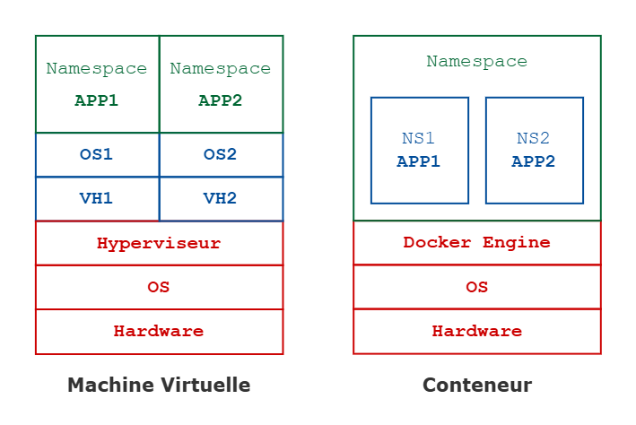
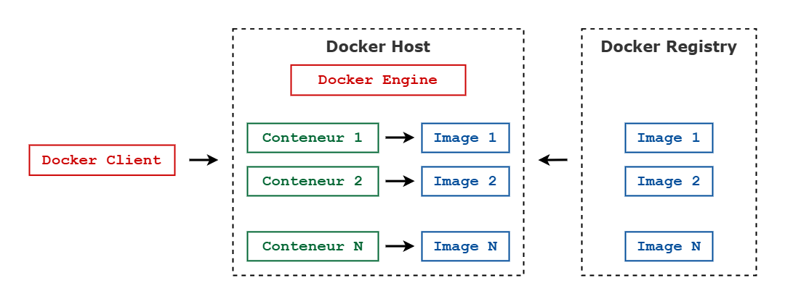

# Docker : La conteneurisation

## Introduction

### Machines virtuelles

#### Limite des serveurs classiques

Initialement, on disposait de serveurs avec une quantité fixe mémoire vive et de mémoire stockage. Mais lorsqu'il y avait des "pics d'utilisation", cette quantité ne suffisait pas. Ces "pics" devaient être anticipés pour éviter une surcharge, voire même un crash. C'est à partir de là que le principe des _Machines virtuelles_ a été mis en place.


#### Virtualisation lourde

```
+===================================+
| Namespace | Namespace | Namespace | 
|   App 1   |   App 2   |   App 3   |
+===================================+
|    OS 1   |    OS 2   |    OS 3   |
+-----------------------------------+
|    VH 1   |    VH 2   |    VH 3   |
+===================================+
|            Hyperviseur            |
+-----------------------------------+
|              OS Hôte              |
+-----------------------------------+
|          Machine Physique         |
+===================================+
```

Avec des _Machines virtuelles_, on recrée un système complet dans un système hôte pour qu'il dispose de ses propres ressources. L'isolation est donc totale par rapport au sytème hôte. 

**Inconvénients**
- prend du temps à démarrer
- réserve des ressources CPU / RAM / Disques

**Avantages**
- totalement isolé du système hôte
- ressources virtuelles entièrement réservées et accessibles sans crainte
- installation d'autant de systèmes d'exploitation différents que souhaité


#### Virtualisation légère

```
+===================================+
|             Namespace             |
| +--------+ +---------+ +--------+ |
| |  NS 1  | |   NS 2  | |   NS 3 | |
| | App 1  | |  App 2  | |  App 3 | |
| +--------+ +---------+ +--------+ |
+===================================+
|   Logiciel de conteneurisation    | => Docker Engine
+-----------------------------------+
|              OS Hôte              |
+-----------------------------------+
|          Machine Physique         |
+===================================+
```

Toute la partie _OS invité_ – qui est généralement très lourde – est supprimée grâce au _Logiciel de conteneurisation_. Les logiciels _OpenVZ_ ou _LXC_ existent depuis longtemps, bien avant _Docker_, et ils apportent une isolation importante des processus systèmes. Les ressources CPU / RAM / Disques sont partagées.

Un _Conteneur_ est un processus – ou un ensemble de processus – isolé du reste du système. Cependant, les _Conteneurs_ partagent le même _Kernel Linux_, l'isolation est donc un peu moindre et on ne peut pas utiliser différents OS sur un même espace serveur. Les ressources physiques ne sont pas virtualisées.

**Inconvénients**
- toutes les applications partagent le même OS, donc le même _Kernel_
- les ressources physiques sont partagées entres les _Containers_

**Avantages**
- lorsqu'on attribue 16 Go à un _Conteneur_ mais que l'application n'utilise que 2 Go, l'exédent de mémoire n'est pas verrouillé
- un _Conteneur_ démarre plus rapidement qu'un _OS Invité_ – une _Machine Virtuelle_ – puisqu'il n'a pas besoin de virtualiser les ressources physiques et qu'il ne consommera que la mémoire nécessaire à l'exécution du programme _Conteneurisé_
- les développeur·euse·s peuvent faire tourner les _Conteneurs_ sur leur poste de travail, ce qui réduit la différence entre la "Sainte Production" et la "Version Développement"


#### Distinctions

Une _Machine virtuelle_ créée un environnement entier qui "imite" un véritable nouvel ordinateur avec un système d'exploitation complet qui "pense" tourner seul sur une vraie machine physique.

Un _Conteneur_ va uniquement exécuter "un seul programme" à l'intérieur d'un environnement virtuel minimaliste. Le système d'exploitation demeure celui de la machine hôte. Et lorsqu'on exécute un _Conteneur_, le logiciel – par ex. _Docker Engine_ – va uniquement simuler quelques composants d'une vraie machine :
* le Système de fichier
* le volume (HDD)
* le réseau

**En somme**
* Les conteneurs réduisent les coûts, et augmentent la densité de l'infrastructure
* Ils peuvent démarrer très rapidement, ils sont utilisés en production pour augmenter les ressources disponibles et répondre aux besoins de scalabilité
* Les conteneurs ne sont pas là pour "remplacer" les machines virtuelles, car un conteneur à besoin d'une machine – virtuelle ou non – pour fonctionner




### Concept de Docker

Créer par _DotCloud_ pour ses besoins de _Platform as a Service_. L'entreprise a finalement créé une nouvelle structure nommée _Docker Inc_ et a placé son produit _Docker_ en open source.

Son principe est basé sur l'exécution de _Conteneurs_ ; lequel ne peut faire tourner qu'un seul processus. Aussi, dans une stack _LAMP_ – _Linux_, _Apache_, _MySQL_, _PHP_ – il faudra 3 _Conteneurs_, un pour le serveur Web _Apache_, un pour la base de données _MySQL_, et un pour le programme _PHP_. Contrairement aux conteneurs mis en place via _LXC_ ou _OpenVZ_, où l'ont aurait pu faire tourner les 3 services dans un même _Conteneur_.


#### Problématiques résolues

- Si on développe un projet d'application, tout va bien se dérouler en local **`->`** _Comment déployer ?_
- Si on travaille à plusieurs sur un même projet avec des OS différents (Windows, MacOS, Ubuntu, CentOS) **`->`** _Comment unifier le développement pour la version de production ?_

Un des premiers usages sera donc la création d'environnements locaux. Cependant, lorsqu'il s'agit de faire persister de grandes quantités de mémoire disque et d'assurer une grande continuité de service, _Docker_ n'est pas vraiment adapté.


#### Images et Conteneurs

Une _Image_ est un binaire, et un _Conteneur_ est un processus qui exécute ce binaire.
- _Images_ = Programmes
- _Conteneurs_ = Processus

Un _Programme_ est une portion de code enregistré quelque part dans les fichiers systèmes. Ce n'est pas exécuté par le processeur en tant que tel, ni une "tâche", c'est simplement quelque chose d'inerte et ça ne "fait rien" en tant que tel.

Un _Processus_ est une copie de ce _Programme_ dans la mémoire vive de l'ordinateur, et qui est en cours d'exécution. On peut avoir de multiples _Processus_ en même temps, tous générés à partir du même _Programme_. Il suffit de les lancer plusieurs fois.

Aussi, une _Image_ est comme un _Programme_, du code dans un fichier quelque part. Un _Conteneur_ est comme un _Processus_, une sorte de copie de l'_Image_ en cours d'exécution. À l'instart des _Processus_, on peut donc lancer plusieurs _Conteneurs_ à partir de la même Image.


#### États et Immutabilité

Deux catégories de conteneurs
- `stateful` : stocke "l'état"
- `stateless` : ne stocke pas "l'état"

Si on prend une base de données, celle-ci est `stateful` puisqu'elle stocke l'état de la base de données. Lorsqu'on éteind puis qu'on ralume la base de données, les données sont toujours là.
À l'inverse, si on prend le protocole HTTP, celui-ci est `stateless`, à chaque requête, les mêmes séries d'actions seront réalisées.

L'immutabilité d'un _Conteneur_ consiste à ne pas stocker de données pérennes à l'intérieure parce qu'il les perdra. Ainsi, il faudra créer un _Volume_ avec une base de données si l'ont souhaite pérenniser des données localement.


### Architecture et fonctionnement

- _Docker Engine_ / _Docker Deamon_ : moteur d'exécution
- _Docker Client_: outils client pour se connecter au _Docker Engine_
- _Image_ : objet exécutable qui contient l'application et tout ce qui est nécessaire pour l'exécution du conteneur
- _Container_ : processus d'exécution, une instance d'exécution d'une _Image_
- _Docker Registry_ : librairie d'images, mises à disposition par des serveurs d'images ou créées par les développeurs


#### Docker Engine

Le _Docker Deamon_, coeur du dispositif, le "deamon" principal qui va 
- gérer les conteners et les exécuter
- gérer l'aspect isolation et l'aspect sécurité
- gérer les resources – notamment la consommation de mémoire ou CPU


#### Docker Client

Outil de connection au _Docker Engine_ et d'administration. Il peut être installé sur la même machine ou sur un poste de travail distant. Le _Docker Client_ peut se présenter sou forme un _CLI_ ou d'un _GUI_ – par ex. _Docker Desktop_.

Dans le cas des serveurs distants, il y a l'outil _Universal Control Plane_ – version "Entreprise" de _Docker_ – avec lequel on pourra, via un navigateur, se connecter et contrôler le _Docker Deamon_


#### Docker Registre

Un serveur d'images, stocke les images en local ou à distance. Permet l'accès aux images en privé – autentification requise – ou en public.

[_Docker Hub_](https://hub.docker.com/) est le _Registry_ officiel de _Docker_.


#### Docker Objects

**Images**

Elles contiennent des binaires et des librairies. Elles peuvent être fournies par des éditeurs ou construites par nous-même. Les images sont stockées localement – là où s'exécute le conteneur. 

Elles sont distribuées au moyen de registres – comme le _Docker Registry_ – et basées sur une ou plusieurs couches appelées _Layers_


**Containers**

Exécute une image complète et se trouve dans un espace isolé d'exécution d'application – appelé un _Namespace_. Un conteneur est autonome et portable. Il contient tout ce qui lui faut pour fonctionner – c'est fournit par l'image. Si une application tombe en panne, on peut reconstruire le même contenur sur le même serveur.


#### Fonctionnenment

Le _Docker Host_ est la machine ou serveur qui exécute le _Docker Deamon_ / le _Docker Engine_. Dans les bonnes pratiques, dès qu'on installe _Docker_ sur un serveur, toute application et tout processus doit s'exécuter dans un conteneur. Le serveur n'est plus un "serveur _Linux_" mais un "serveur _Docker_" qui exécute des conteneurs.

Le _Client Docker_ se connecte au _Docker Host_ et va lui soumettre des requêtes – par ex. "Créer un conteneur à partir d'une image" `docker run image-1`




---


## Démarrage

### Installation

#### Distributions

* _Docker Community Edition_ sur _Linux_ : elle sera exactement identique à celle sur ses serveurs
* _Docker Desktop_ sur _MacOS_ ou _Windows_ : _Docker_ créera lui-même les services nécessaires à son bon fonctionnement
* _Docker Enterprise_ sur _Linux_ : très différentes des versions _Desktop_ et _CE_, elle propose une interface de gestion d'infrastructures sous _Docker_

_Docker Desktop_ et _Docker CE_ sont deux versions gratuites avec lesquelles on a un _Docker_ fonctionnel sur son ordinateur.

Lorsqu'on souhaite faire une installation sur seveur ou dans WSL, le choix se porte sur [_Docker Engine_](https://docs.docker.com/engine/install/) seul.


#### Docker CE / Engine

L'installation se fait selon sa distribution – par ex. [Ubuntu](https://docs.docker.com/engine/install/ubuntu/). Ensuite, certaines configurations sont à faire [après l'installation](https://docs.docker.com/engine/install/linux-postinstall/).


#### Docker Desktop

Innclut les éléments suivants
* [_Docker Engine_](https://docs.docker.com/engine/)
* Docker CLI client
* [_Docker Buildx_](https://docs.docker.com/build/) : feature la plus utilisée du _Docker Engine_
* [_Docker Extensions_](https://docs.docker.com/desktop/extensions/) : pour utiliser des extensions tièrces dans _Docker Desktop_
* [_Docker Compose_](https://docs.docker.com/compose/)
* [_Docker Content Trust_](https://docs.docker.com/engine/security/trust/) : utilisable à travers le _Docker CLI_, il permet d'utiliser des signatures dans les données envoyées ou reçues depuis un _Registry_
* [_Kubernetes_](https://github.com/kubernetes/kubernetes/)
* [_Credential Helper_](https://github.com/docker/docker-credential-helpers/)

Pour les environnements _Windows Enterprise_ ou _Windows Professional_, _Docker_ propose un utilitaire qui va créer une machine virtuelle _Hyper-V_ et procéder à l'installation de _Docker Desktop_.

Dans le cas contraire, il faut exploiter le sous-système _Linux_ – _WSL 2_.


### Composantes

#### Docker Hub

Le [registre officiel](https://hub.docker.com/) de _Docker_, où sont stocké les images. Il permet
- de distribuer, partager des images prêtes à l’emploi et de les versionner avec un système de tags
- aux outils d’intégration en continu de lancer une série de tests, sans avoir besoin d’autre chose que de _Docker_
- aux systèmes automatisés de déployer des applications sur ses environnements de développement et de production

Les images sont classées par "contenu de confiance"
- _Docker Official Images_ : proviennent de l'éditeur lui-même
- _Verified Publishers Images_ : non-officielles, mais proviennent d'éditeurs vérifiés et reconnus
- _Sponsored OSS Images_ : proposées par des projets _Open Source Software_ et sponsorisées par _Docker_

**Registres alternatifs**
- _Software as a Service_
    - [_Amazon Elastic Container Registry_ - ECR](https://aws.amazon.com/fr/ecr/)
    - [_Google Container Registry_ – GCR](https://cloud.google.com/artifact-registry?hl=fr)
    - _Red Hat Quay_ – quay.io
- _On-premise_ stockage sur leurs propres serveurs
    - _Habor_ – _VMware_
    - GitLab Container Registry


#### Docker Buildx

L'instruction `docker build` va construire un conteneur pour chaque instruction présente dans le _Dockerfile_. Chaque résultat sera sauvegardé dans une _Layer_ et le résultat final constituera un ensemble de _Layers_ établissant l'image complète.

La construction _Docker_ est une construction "optimisée". Si une _Layer_ ne change pas entre deux `docker build`, _Docker_ ne la reconstruit pas. Seules les _Layers_ ciblées par la modification et celles situées après seront reconstruites. De nouvelles images peuvent être créées très rapidement, sans devoir attendre indéfiniment la construction de son image.

Par exemple, si on ajoute une nouvelle dépendance dans un fichier `package.json`, et qu'on relance un `docker build` de son image, il n'y aura que les _Layers_ situées après l'instruction `ADD package .json /app/` qui seront reconstruites – cf. [Sample Dockerfile](_resources/Dockerfile) – l'installation initiale restera en cache.


#### Docker Compose

[Un outil](https://docs.docker.com/compose/) qui permet de gérer facilement plusieurs conteneurs à la fois. 

Une application pourrait nécessiter
* un conteneur qui extrait des donneés d'un site web
* un conteneur qui reçoit des données et les nettoie
* un conteneur pour faire persister les données, pour la base de données
* un conteneur pour gérer l'API

Si l'on souhaite faire tourner entièrement l'application et ses services, on va devoir démarrer chaque conteneur manuellement. Si l'on change le code de tous les conteneurs, il faudra les reconstruire un par un.  Et si en plus, on souhaite partager des _Volumes_ entre conteneurs, ça deviendra encore plus fastidieux.

Aussi, un fichier `docker-compose.yaml` permet de définir et gérer tous les conteneurs utiles à une application, et où les `Dockerfiles` de chaque conteneur se trouvent. On peut également y définir et créer un _Volume_ qui va lier autant de conteneurs qu'escompté.


### Exploitation des images

#### Observations locales

Pour connaitre les _Images_ disponibles localement
```sh
docker images
```
Pour voir le SHA-256 de l'id en entier
```sh
docker images --no-trunc
```

Informations
- `REPOSITORY` : le "nom" de l'image
- `TAG` : la version de l'image
- `IMAGE ID` : un `SHA-256` (tronqué)
- `CREATED` et `SIZE` : la date de création et son poid


#### Observations _Hub_

Pour chercher une image sur le _Docker Hub_ – l'option `--no-trunc` affiche la description complète
```sh
docker search nginx
```

Informations
- `NAME` : le "nom" de l'image, pour _Nginx_ il s'agit d'un domaine racine, un _Namespace_ qui contiendra toujours les images officielles. Ensuite les autres images auront une notion soit de user, soit d'organisation, qui précède l'image comme _bitnami/nginx_
- `DESCRIPTION` : (tronquée) permet de savoir s'il s'agit d'une image officielle fournie par le distributeur
- `STARS` : appréciation des internautes
- `OFFICIAL` : si elle est officielle
- `AUTOMATED` : si elle est automatisée, l'éditeur peut définir le fichier de configuration et de création de l'image, et peut le positionner sur un dépôt distant et automatiser la génération de l'image vers _Docker Hub_ – compte payant requis.


#### La notion de Versions

Par défaut un `pull` chargera la dernière version avec le tag `latest`
```sh
docker pull nginx
```
Pour charger une version spécifique
```sh
docker pull nginx 1.23.3
```

Lorsqu'on charge une image à partir du _Docker Hub_ – ou d'un registre privé – plusieurs `pulls` se succèdent. Chacun correspond à une "couche" de l'image. Par défaut, si on ne spécifie pas le _Tag_, on va charger la dernière version – `latest`. Plusieurs _Tag_ peuvent faire référence à la même image physique – par ex. `nginx latest` et `nginx 1.23.3` représentent une même image. 

Suite à ça, si on charge une version antérieure ou postérieure – par ex. `1.22` – plusieurs `pulls` vont à nouveau se succéder mais avec 1 en moins : celui qui représente l'image de base et qui est défini par la couche `FROM` dans le _Dockerfile_ – par ex. `debian:bullseye-slim`. L'image de base est déjà présente sur le disque grâce au `docker pull` précédent. Il y aura donc un "ajout de référence" et non un téléchargement physique.


### La commande `docker`

```sh
docker --help | more # lister et paginer les commandes Docker
```

Classées par utilisation, par ex. les _Management Commands_ vont s'exécuter sur un des objets précisés – `build`, `Compose`, `container`, etc. Il y a aussi la liste des options globales propres au _Docker Client_.


#### Inspecter les objets

Un _Docker Object_ peut être un conteneur, une image, un réseau, un volume, etc. Tout ce qui est succeptible de tourner sur le _Docker Host_

Pour inspecter un conteneur en cours d'exécution – format JSon
```sh
docker inspect container_name | more
```
Pour consulter uniquement un champ
```sh
docker inspect -f '{{ .NetworkSettings.IpAddress }}' container_name
```


---


## Annexes

### Glossaire

**Hyperviseur**


### Pour en savoir plus

- [Démarrer - Docker Docs](https://docs.docker.com/get-started/)
- [Guides - Docker Docs](https://docs.docker.com/guides/)
- [Référence CLI - Docker Docs](https://docs.docker.com/reference/cli/docker/)
