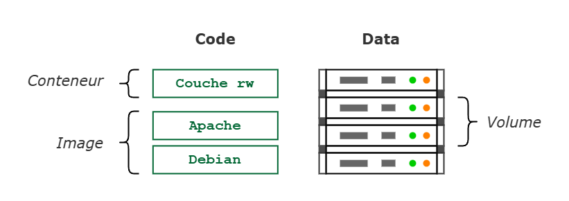
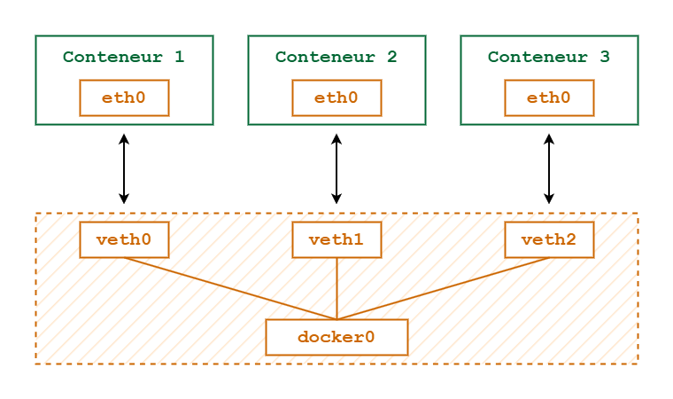
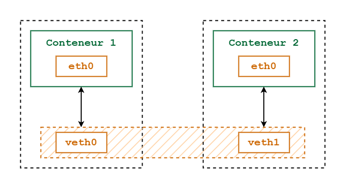

# Docker : Connaissance avancée

## Sommaire
1. [Volumes](#volumes)
    - [Principes](#principes)
    - [Création locale](#création-locale)
    - [Remarques](#remarques)
    - [Externalisation](#externalisation)
1. [Réseaux](#réseaux)
    - [Le modèle en réseau](#le-modèle-en-réseau)
1. [Annexes](#annexes)
    - [Glossaire](#glossaire)
    - [Pour en savoir plus](#pour-en-savoir-plus)

---

## Volumes

### Principes

Un _Volume_ est un dispositif de stockage extérieur au conteneur, par ex. un disque ou un partage réseau. Le _Volume_ permet de dissocier les données du conteneur et comporte deux intérêts
- la _persistance des données_ : le conteneur peut se terminer et être supprimé, les données persisteront, on pourra recréer un conteneur qui accèdera aux mêmes données
- la _performance_ : on peut créer un _Volume_ sur un disque plus performant que le disque interne du _Docker Host_ – par ex. sur un SSD ou un volume en RAM.


#### Distinction Processus et Volume

Lorsqu'on lance un conteneur, une couche en "read/write" s'ajoute au sommet de l'image. Les différentes couches de l'image sont montées en "read only". Par défaut, si un conteneur créé des données, ces données iront dans la couche "read/write". Un conteneur est éphémère, c'est juste un processus qui exécute du code : il ne doit jamais créer des données à persister dans la couche "read/write". Les données créées doivent toujours être écrites sur un dispositif externe qu'on appelle un _Volume_.




#### Les données impliquées dans les Conteneurs

Il y a trois types de données
- Les _Data_ : des données créées par l'application, comme une base de données.
- Les _Metadatas_ : des données de gestion ou de logs des journaux, etc.
- Les _Config Files_ : des fichiers de configuration, qui peuvent aussi être sur des volumes externes, fournis en lecture aux conteneurs au moment de la création du conteneur.

Si on veut modifier la configuration d'une application, on arrête le conteneur par `docker stop`, on modifie les fichiers de configuration dans le volume et on redémarre le conteneur avec `docker restart`, ce qui permet de redémarrer le conteneur en mettant en place un nouveau processus – ou nouveau _Docker Daemon_ – avec la nouvelle configuration.


#### Création d'un Volume

```sh
docker volume create myvolume
```
Lister les volumes
```sh
docker volume ls
```

Un volume contient certaines caractéristiques, on peut examiner les caractéristiques du volume – format JSon
```sh
docker volume inspect myvolume
```
La valeur `"Mountpoint"` est le "point de montage". Par défaut, l'aborescence est `"var/lib/docker"` qui est le dossier où se trouvent tous les _Docker Objects_, et entre autres, les volumes. Donc, les données seront physiquement présentes dans ce dossier-là par défaut.


### Création locale

#### Volumes d'hôtes

Un volume est un répertoire ou un dossier du _Docker Host_ qui est partagé avec le conteneur.
Si on créé un fichier dans un conteneur, ce fichier sera présent dans le _File System_ du _Docker Host_ et aura le même propriétaire – `root` – puisque le dossier est partagé et que les conteneurs sont lancés en mode `root` par défaut.
```sh
docker run -it -v /home/elo/data:/data centos:7

# Voir les informations File System dans le conteneur
df -h

# CTRL + P + Q >> Voir les informations File System sur l'hôte
df -h .
```

Dans les images des distributions _Linux_, généralement il n'y a pas l'habituel _User_ `id:1000`. Une bonne pratique consiste à recréer une nouvelle image à partir de l'image de base, et d'y créer un _User_.
Exemple : un conteneur _CentOS_ lancé avec un terminal interactif et un volume monté sur `/data`
```sh
# Création d'un nouvel user avec l'id 1000
useradd -u 1000 elo
exit
```

Ensuite, on "valide" les changements avec l'id du conteneur dans lequel on a créé le nouvel _User_ pour ainsi créer une nouvelle image.
```sh
docker commit 59528af3b988 centos:user
```
Création d'un nouveau conteneur avec le nouvel _User_
```sh
docker run -it -v /home/elo/data:/data --user=elo centos:user
```
Création d'un fichier
```sh
touch /data/userfile 
```
Lister les fichier dans le dossier
```sh
ls -l /data # -rw-rw-r-- 1 elo  elo  0 Sep 16 10:54 userfile
```


#### Partage de volumes

Un volume est extérieur à un conteneur, on peut donc partager un même volume entre plusieurs conteneurs.
Création d'un volume appelé `share`
```sh
docker volume create share
```
Création de deux conteneurs qui utiliseront le même volume
```sh
docker run -it -d -v share:/data --name alphahost centos:7
docker run -it -d -v share:/data --name betahost centos:7
```

On peut créer un fichier à partir du conteneur `alphahost`, et en même temps l'exploiter à partir du conteneur `betahost`.
Création d'un fichier à partir du conteneur 'alphahost'
```sh
docker attach alphahost
echo 111 > /data/sharedfile
```
Lecture du fichier précédemment créé et ajout de valeur
```sh
docker attach betahost
cat /data/sharedfile
echo 222 >> /data/sharedfile
```
Lecture du même fichier à partir de 'alphahost', le fichier contient "111 222"
```sh
docker attach alphahost
cat /data/sharedfile
```

Lorsque deux conteneurs – donc présumé, "deux applications" – tournent en parallèle et écrivent des données dans un même fichier, il y a un risque de "corruption de données". Pour éviter que les données ne soient corrompues, les applications doivent se synchroniser avant d'écrire dans un fichier commun.


#### Partage de conteneur de données

Pour des applications "multi-containers", on peut lancer un premier container qui contient tous les volumes, et avec les autres conteneurs, on fait référence au premier container. 

Un conteneur de données simplement un conteneur lancé une première fois avec des volumes et des points de montage. Ensuite, les autres conteneurs qui font partie de la même application vont spécifier qu'ils monteront les même volumes que le premier conteneur sur les mêmes points de montage.

Création d'un premier conteneur avec des volumes et points de montage, et création de fichiers
```sh
docker run -it -v /data -v /html --name myinitapp centos:7
echo 111 > /data/file1
echo 222 > /html/file2
```

Ensuite création d'autres conteneurs pour lesquels on va spécifier des volumes associés au premier conteneur via `--volumes-from`
```sh
docker run -it -d --volumes-form=myinitapp --name hostone centos:7
docker run -it -d --volumes-form=myinitapp --name hosttwo centos:7
```
Observation des fichiers associés au conteneur `myinitapp` à partir d'un autre conteneur
```sh
docker attach hostone
cat /data/file1 # 111
cat /html/file1 # 222
```


#### Les volumes dans un _Dockerfile_

Exemple avec l'image [mysql](https://github.com/docker-library/mysql/blob/eb1850601849ef7ef77a23f017a20debc95d597c/innovation/Dockerfile.oracle), elle contient une instruction de création de volume
```Dockerfile
VOLUME /var/lib/mysql
```
Création d'un conteneur sans préciser un nom de volume
```sh
docker run -e MYSQL_ROOT_PASSWORD=mypassword -d mysql
```
Un volume anonyme sera créé par l'image _mysql_
```sh
docker volume ls
```
Si on construit un deuxième conteneur depuis la même image _mysql_, un deuxième volume anonyme sera créé. Au final, on ne saura plus à quel volume appartient quel conteneur.

L'idéal est donc de créer ses propres volumes et de construire ses conteneurs en spécifiant quel volume a été créé pour le conteneur.
```sh
docker volume create myapp_db
```
Création du conteneur _mysql_ en précisant le volume de référene
```sh
docker run -e MYSQL_ROOT_PASSWORD=mypassword -d -v myapp_db:/var/lib/mysql mysql
```


### Remarques

Il est important de créer le répertoire ou le dossier avant de créer le conteneur avec un volume. Sinon, le répertoire mappé sur le _Docker Host_ ne sera accessible qu'en tant que `root` et non pas en tant que `1000:elo`.


### Externalisation

#### Volumes sur disques externes

On peut créer un volume sur un disque externe de type _ISCI_. _ISCI_ va gérer les disques _SATA_, les disques _ISCI / SAN_ et même les disques _ISCSI_. Il faut définir diverses options
- le `device`
- le `type` de _File System_ qui est à l'intérieur du disque

Lorsqu'on récupère un _LUN_ il faut qu'il soit formaté et qu'il y ait un _File System_.
```sh
docker volume create --opt device=/dev/sdb1 --opt type=xfs sdb1
```


#### Volumes sur un partage réseau NAS

Deux conteneurs qui s'exécutent sur des _Docker Hosts_ différents peuvent se partager des données grâce à un partage réseau de type _NFS_ – _Network File System_.

Observation des dossiers partagés par le server _GW_ vers tout le monde, exemple depuis `elo@host1` et depuis `elo@host2`
```sh
sudo showmount -e gw # Export list gw : /shares *
```

Syntaxe de la création d'un volume _NAS_
```sh
docker volume create --driver local \
    --opt type=nfs \
    --opt o=addr=192.168.1.1,rw \
    --opt device=:/path/to/dir \
    mynasvolume
```

Création d'un point de montage avec une arborescence classique `/var/lib/docker` mais à partir d'un serveur distant – sur `elo@host1` et sur `elo@host2`
```sh
docker volume create --opt type=nfs --opt o=addr=gw,rw --opt device=:/shares nfs_gw
```
Observation `"Options"`
```json
[
    {
        "CreatedAt": "2023-02-23T14:43:40+01:00",
        "Driver": "local",
        "Labels": null,
        "Mountpoint": "/va/lib/docker/volumes/nfs_gw/_data",
        "Name": "nfs_gw",
        "Options": {
            "device": ":/shares",
            "o": "addr=gw,rw",
            "type": "nfs"
        },
        "Scope": "local"
    }
]
```

On peut ensuite créer un conteneur sur chaque machine qui va monter le volume _NAS_ – sur `elo@host1` et sur `elo@host2`
```sh
docker run -it -d -v nfs_gw:/data --name apphost1 alpine
```

Depuis le conteneur `apphost1` sur `elo@host1` par exemple, la commande `df -h /data` affichera 
```
Filesystem      Size        Used        Available       Use%        Mounted on
:/shares        50.0G       2.0G        27.9G           44%         /data
```

Toute création de fichier dans `/data` dans `host1` ou `host2` sera en partage entre les deux conteneurs respectivement sur les deux machines.


#### Volume sur la _RAM_

Dans _Unix / Linux_, _TMPFS_ – _Temporary File System_ – fait référence à un système de fichiers _RAM_. L'intérêt est d'optimiser les "entrées/sorties"
- pour une application qui utilise du cache, car un cache en _TMPFS_ sera plus performant qu'un cache disque
- ou pour une application qui créée beaucoup de fichiers temporaires. 
Dans ces cas-là on va optimiser les "entrées/sorties" sur ces fichiers-là. Il n'y a pas de persitance, si on utilise un volume de ce type dans un conteneur, dès qu'il sera arrêté il perdra les données.

Syntaxe de la création d'un volume _TMPFS_
```sh
docker volume create --driver local \
    --opt type=tmpfs \
    --opt device=tmpfs \
    --opt o=size=100m,uid=80 \
    volume_name
```
Afin de ne pas défavoriser l'application par rapport à l'utilisation de la _RAM_, on va limiter la taille exploitable – par ex. `100 Mo` – et lui fournir une arborescence qui va être la propriété _UID_ – par ex. `80` – pour l'application qui utilisera la _RAM_ – par défaut c'est `0` donc `root`, cf. `cat /etc/passwd`. 


---


## Réseaux

### Le modèle en réseau

#### Réseau type _Bridge_

Type le plus utilisé puisque c'est le réseau par défaut lorsqu'on créé un conteneur
- Privé, donc interne à _Docker Host_, il n'est pas visible sur le réseau local auquel est connecté le _Docker Host_
- Trafic sortant du conteneur passe par la passerelle à l'aide du _NAT_ – _Network Address Translation_
- Trafic entrant dans le conteneur passe par le _Docker Host_ est dirigé à l'aide du _PAT_ – _Port Address Translation_, qu'on appelle aussi du "mapping de port".

Un "bridge" est comme un "switch" ou un "segment" _Ethernet_. _Docker_ va créer sur ce bridge un _Virtual Ethernet_ par conteneur. C'est l'équivalent d'un port au niveau du "switch". Par ex. : un _VEth0_ pour le premier conteneur, un _VEth1_ pour le deuxième, etc ; et à l'intérieur de chaque conteneur on retrouve l'interface standard _Linux_ _Eth0_. _Docker0_ est l'interface du _Docker Host_ sur le bridge _L2_. 




#### Réseau type _Overlay_

- Privé, donc non accessible à partir du réseau local mais pourtant commun à plusieurs _Docker Host_
- Communication privée entre conteneurs sur ce réseau, quel que soit le _Docker Host_ sur lesquel un conteneur s'exécute
- _NAT_ et _PAT_ sont toujours utilisés respectivement pour le trafic sortant et entrant puisque ça reste un réseau privé.

Un réseau overlay va permettre au conteneur 1 sur le _Docker Host 1_ de communiquer via ce réseau privé avec le conteneur 2 qui s'exécute sur le _Docker Host 2_. Le réseau est privé mais commun à plusieurs _Docker Hosts_. 

Le réseau Overlay est surtout utilisé dans le cadre d'un cluster _Swarm_. Un cluster de plusieurs _Docker Hosts_ pour équilibrer la charge d'exécution des conteneurs sur l'ensemble des _Docker Hosts_ présents. Ça permet aussi d'amener des fonctions de "scalable" et des fonctions de "haute disponibilités", etc. _Swarm_ est le logiciel cluster de _Docker_ on appelle ça aussi un orchestrateur de conteneurs. 




#### Réseau type _Host_

Permet au conteneur d'être sur la même pile – ou la même stack – _TCP/IP_ que le _Docker Host_. Il n'y a plus d'isolation et plus d'étanchéité au niveau réseau entre le _Docker Host_ et les conteneurs. Ça évite d'utiliser le _NAT_ si le conteneur ouvre beaucoup de port, mais donc ça expose aussi tous les services directement sur le réseau local.


#### Observer les réseaux _Docker_

Si on observe les interfaces réseaux sur la machine, via la commande `ip a`, on retrouve celle de _Docker_
```
3: docker0: <BROADCAST,MULTICAST,UP,LOWER_UP> mtu 1500 qdisc noqueue state UP group default
   ...
```
Y figure l'IPv4 du conteneur, le masque de sous-réseau, la portée, la durée, etc.
- `inet 172.17.0.1/16 brd 172.17.255.255 scope global docker0 valid_lft forever preferred_lft forever`

À l'installation, _Docker_ a créé 3 réseaux qui ont tous une portée locale au _Docker Host_. Ça signifie que si on a d'autres _Docker Hosts_ sur le réseau local de la machine, ils ne pourront pas accéder au réseau interne de chaque _Docker Host_.
```sh
docker network ls
```
Affichage des 3 réseaux sur le _Docker Host_, avec leurs noms, leurs types et leurs portées respectifs.
```
NETWORK ID     NAME      DRIVER    SCOPE
5051a300886f   bridge    bridge    local
43957fc885cf   host      host      local
fefceae4c915   none      null      local
```

Si on créé deux conteneurs, chacun va obtenir un _Virtual Ethernet_ sur le bridge _Docker0_.
```sh
docker run -it -d --name cont1 alpine
docker run -it -d --name cont2 alpine
```

À partir de la machine, la commande `ip a` présentera les nouveaux _Virtual Ethernets_ créés pour ces deux conteneurs.
Exemple : pour le `cont1`
```
13: veth7c943a6@if12: <BROADCAST,MULTICAST,UP,LOWER_UP> mtu 1500 qdisc noqueue master docker0 state UP group default
   ...
```
À partir du conteneur `cont1`, la commande `ip a` présentera l'interface `eth0` branchée à au _Virtual Ethernet_ `if13`
```
12: eth0@if13: <BROADCAST,MULTICAST,UP,LOWER_UP,M-DOWN> mtu 1500 qdisc noqueue state UP
   ...
```

Inspection du réseau nommé `bridge` – de type "bridge"
```sh
docker network inspect bridge
```
Affichage des propriétés du réseaux – `"Name", "Id", "CreatedAd", ...` – et aussi des propriétés des conteneurs qui y sont connectés
```js
[
    {
        // ...
        // Détails des conteneurs sur le réseau
        "Containers": {
            "6dc8eba5650cc64e6334666c67e9d03f9496409ea357b496c8e8952db7b6e1c2": {
                "Name": "cont1",
                "EndpointID": "9be463ea78a030fd966c6890503c8006c33aacf6255ff8894c82736dc5ce8258",
                "MacAddress": "02:42:ac:11:00:03",
                "IPv4Address": "172.17.0.3/16",
                "IPv6Address": ""
            },
            "ee55d1f8fb598311e3063d4c9f5ac6ff16bde9a3b9af571ea0bc809d4d38db50": {
                "Name": "cont2",
                "EndpointID": "1f3715d13b2e5e87cc4a2b88c8386b58d5fc5087c0c75d9b9b1018435f00d98d",
                "MacAddress": "02:42:ac:11:00:04",
                "IPv4Address": "172.17.0.4/16",
                "IPv6Address": ""
            }
            // ...
        }
        // ...
    }
]
```


## Exploitation

#### Mise en réseau _Bridge_

Si on essaie de "pinguer" le `cont2` à partir du `cont1` via `ping cont2` on obtiendra un `bad address cont2`. Par défaut, sur le réseau `bridge` il n'y a pas de _DNS_. En revanche, si on utilise l'ip du conteneur, `172.17.0.4`, au lieu d'utiliser son nom, on peut voir qu'il y a bien une communication entre les deux.

Sur le réseau type "bridge", il y a une option qui s'appelle `link`, et qui permet de lier les conteneurs. Mais elle est dépréciée, il est donc **déconseillé de l'utiliser, de même que d'utiliser le réseau bridge par défaut**.

Une bonne pratique consiste à créer un nouveau réseau de type bridge également
```sh
docker network create my_network
```
Et d'y placer ses conteneurs.
```sh
docker run -it -d --network=my_network --name cont1 alpine
docker run -it -d --network=my_network --name cont2 alpine
```

À présent, lorsqu'on "ping" le `cont2` à partir de l'intérieur du `cont1`, la résolution IP a fonctionné pour la référence `cont2`. Par défaut, les numéros de réseaux vont s'incrémenter mais on a la possibilité via l'option `--subnet` de paramétrer les masques de sous-réseaux que l'on veut créer.

Si un conteneur, par ex. `cont0`, se trouve sur un autre réseau que celui de `cont1` et `cont2`, il ne pourra pas communiquer avec les autres puisque les réseaux sont "étanches", isolés les uns des autres. Mais il est possible de le connecter au réseau de `cont1` et `cont2`.
```sh
docker network connect my_network cont0
``` 
Un conteneur peut avoir plusieurs réseaux, ce peut être pour une fonction de communication, de filtrage, ou autres.


#### Mise en réseau _Host_

Vérifier que Docker n'ouvre pas le port 80
```sh
netstat -ant | grep -w 80 
```
Mise sur le réseau host
```sh
docker run -it -d --network=host --name=web nginx
```

Si on inspecte le conteneur `nginx` en éxécution avec la commande `docker ps`, on voit que le conteneur `web` ne fait référence à aucun port exposé. Son port n'est pas exposé sur un réseau privé. Donc, si on refait un `netstat -ant | grep -w 80`, on voit que le _Docker Host_ est à l'écoute du port 80.

Aussi, lorsqu'on se connecte sur un autre _Docker Host_, `host2`, et qu'on fait un `curl host1`, on a bien l'exécution du serveur web `nginx`. Donc, le container utilise la stack TCP/IP du host, et lorsqu'il y a des requêtes de l'extérieur vers le port 80 du `host1`, ces requêtes sont redirigées vers le service fourni par le conteneur `web`. On peut le constater en inspectant le réseau _Host_ du `host1`.
```sh
docker network inspect host
```
Le conteneur `web` figure parmis les conteneurs dans ce réseau mais il ne contient pas d'apresse IP. Il est donc directement connecté sur la stack TCP/IP du _Docker Host_, c'est-à-dire avec la configuration réseau du réseau local de la machine : `192.168.98.11` – qui est le réseau local pour les deux _Docker Host_. 


#### Mise en réseau _None_

Mise sur le réseau none
```sh
docker run -it --network=none --name=batch alpine
```

Typiquement, toutes les commandes qu'on exécute sur un _Docker Host_ doivent être exécutée dans un conteneur. Mais pour éviter de gaspiller des adresses IPs – si on a beaucoup de processus à lancer –, on peut les lancer sur le réseau _None_. Les conteneurs n'auront pas d'adresse IP, donc c'est intéressant pour des processus _batch_ qui vont s'exécuter localement. 

À partir du conteneur `batch`, si on observe sa configuration `ip a`, on voit qu'il n'a pas de réseau. Et lorsqu'on inspecte le réseau _None_ avec la commande `docker network inspect none`, on voit que le conteneur `batch` n'a pas non plus d'IP.


#### Mapping de ports

L'idée est de pouvoir accéder, depuis l'extérieur, à des conteneurs dans des réseaux privés qui fournissent des services.
Toujours créer un réseau de type `bridge` avec une portée locale
```sh
docker network create online
```

**Mapping manuel**

Lancement d'un conteneur sur le réseau `online`
```sh
docker run -it -d --network=online -p 8000:80 httpd
```
L'option `-p` permet de "mapper" le port `8000` du _Docker Host_ vers le port `80` du conteneur `http`. Ça veut dire que le trafic qui arrive sur le _Docker Host_ par le port `8000` sera redirigé vers ce conteneur. La commande `docker ps` affiche les ports exposés, et le "mapping" se distingue par la notation flèchée et un protocole par défaut `tcp`.
```yml
0.0.0.0:8000->80/tcp # le port 8000 du _Docker Host_ est redirigé vers le port 80 du container
```

On voit surtout que, par défaut, le _Docker Host_ écoute sur toutes les IP – cf. `0.0.0.0`. Ça veut dire que le serveur est à l'écoute du port 8000 pour n'importe quelle adresse IP. On peut donc arriver sur ce port :
- avec son adresse IP du réseau local
```sh
curl 192.168.98.11:8000
```
- avec l'adresse IP localost
```sh
curl 127.0.0.1
``` 

Ça fonctionne également à partir d'une autre machine – un autre _Docker Host_. À partir de l'extérieur, par ex. la machine `host2`, on peut faire `curl sur host1:8000`.

Par contre, si on définit une IP spécifique, on verra que cette fois le serveur écoutera le port `8001` seulement pour cette adresse.
```sh
docker run -it -d --network=online -p 127.0.0.1:8001:80 httpd
```
Tests
```sh
curl 127.0.0.1:8001 # ok
curl 192.168.98.11:8001 # Failed connection to 192.168.98.11:8001; Connexion refusée
```

**Mapping automatique**

Cette fois on utilise l'option `-P`
```sh
docker run -it -d --network=online -P httpd
```

Il n'y a pas de port spécifique "mappé" au niveau du _Docker Host_ et on ne désigne pas le port qui est redirigé au niveau du container.
Observation avec la commande `docker ps`
```sh
0.0.0.0:32768->80/tcp
```
Le port sur le _Docker Host_ est généré de manière automatique – ou "dynamique" – alors que le port du container est quand même 80. Dans l'image du conteneur, l'instruction `EXPOSE 80` expose le port d'écoute.


**Service non-mappé**

Service serveur non-mappé
```sh
docker run -it -d --network=online --name=apache httpd
```
Le service ne sera pas accessible depuis l'extérieur. Seuls les conteneurs du même réseau que ce service pourront accéder au service. 
Observation avec la commande `docker ps`
```sh
80/tcp
```
Le container _Apache_ a juste exposé le port `80`, il n'est pas "mappé".


---


## Annexes

### Glossaire

**ISCSI**
_Internet Small Computer System Interface_, un protocole de stockage en réseau basé sur le protocole IP destiné à relier les installations de stockage de données.

**LUN**
_Logical Unit Number_, un identifiant logique qui réfère un disque physique, ou éventuellement une partition d'un volume plus large.


### Pour en savoir plus

