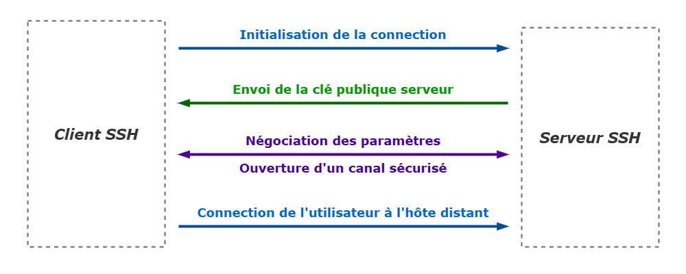

# Pratique : Secure Shell

## Généralités

### Secure Shell

Un logiciel qui sécurise l'administration de système ou le transfert de fichier à travers des réseaux non-sécurisés.


### Protocole SSH

Pour la connexion sécurisée à distance et le transfert sécurisé de fichiers.

Ce protocole fonctionne sur un modèle client-serveur. La connexion est établiée par le client SSH qui se connecte à un serveur SSH. Le client SSH gère le processus d'initialisation de la connexion et utilise des clés publiques cryptées pour contrôler l'identité du sserveur SSH. Après cette initialisation, le protocol SSH utilise un cryptage symétrique fort et des algorithmes de hashage pour assurer l'intégrité et la confidentialité des données échangées entre le client et le serveur.




### Clés SSH

D'un point de vue technique, le clés SSH sont des clés cryptographiées utilisant un système de cryptage de clé public.

D'un point de vue fonctionnel, les clés SSH "ressemblent" aux mots de passe. Elles accordent l'accès et contrôlent "qui peut accéder à quoi". Ce sont des informations d'identification et doivent être gérées en tant que telles. En terme de gestion d'identité et d'accès, elles requièrent des polices similaire, un approvisionnement et une terminaison similaire aux comptes et mots de passe d'utilisateurs.


#### Clés d'authentification d'usage

Simplement appelée les "clés SSH".
 
**Authorized keys, access credentials**
Les clés d'autorisation sont des clés publiques qui accordent l'accès et définissent qui peut accéder à chaque système. Elles sont analogues aux verrous qu'une clé privée peut ouvrir.

**Identity keys**
Les clés d'identité sont des clés privées qui identifient un utitisateur et fournissent un accès. Le client SSH utilise cette clé pour s'autentifier lorsqu'il se connecte à un serveur SSH. Elles sont analogue aux vraies clés qui permettent d'ouvrir un ou plusieurs verrous.

Les clés d'autorisation et d'identité sont conjointement appelées "clés d'utilisateur" – user keys. Elles relève de l'autentification utilisateur par opposition aux clés d'hôte qui concernent l'autentification d'hôte.


#### Clés d'autentification matériel

**Hôte**
Les clés d'hôte sont utilisées pour l'autentification d'hôtes – par ex. les ordinateurs. Elles servent à éviter l'attaque "man-in-the-middle".

**Hôte connu**
SSH mémorise et reconnait une clé d'hôte lors de la première connection, et la désigne comme une clé d'hôte connu. Ces clés sont stockées dans le fichier `~/.ssh/kwown_hosts`. Cette approche est suffisante pour garantir l'intégrité et la sécurité aussi longtemps que les clés d'hôte ne changent pas. Dans le cas contraire il sera préférable de passer par des certificats d'autorité. [Tectia SSH](https://www.ssh.com/products/tectia-ssh/) gèrent les certificats standards X.509 pour hôtes. Mais OpenSSH gère son propre format de certificat.


### Autentification SSH

Initialisation d'une connection SSH
- Négociation de la version du protocole
- Négociation de l'algorithme cryptographique et des autres options à utiliser
- Négociation d'un clé de session à usage unique pour crypter le reste de la session de connexion
- Authentification du serveur avec sa clé d'hôte
- Authentification de l'utilisateur avec un mot de passe (la passphrase), la clé plublique d'autentification, ou d'autres moyens


---


## Utilisation

### WSL et Linux

Pratiquement tous les système UNIX / Linux incluent la commande `ssh` – et donc le client OpenSSH. Cette commande est utilisée pour démarrer le client SSH qui peut établir des connexions sécurisées avec des serveurs SSH à distance. Elle sert donc à se connecter sur des machines distantes, à transférer des fichiers entre deux machines distantes, et à exécuter des commandes sur des machines distantes.

Autres commandes :
- `ssh-keygen` : créer une pair de clés pour l'authentification par clé publique
- `ssh-agent` : gestionnaire de clés qui contient les clés privées pour le Single Sign-On (le SSO)
- `ssh-add` : outil d'ajout de clé au gestionnaire (le SSH Agent)
- `ssh-copy-id` : configurer une clé publique comme autorisée sur un serveur
- `sftp` : client de transfert de fichiers avec une interface de commandes similaire au File Transfert Protocol (le FTP)
- `sshd` : serveur OpenSSH


#### Générer une pair de clés

Algorithmes principaux
- rsa : le vieil algorithme par défaut, auquel il faut spécifier une taille : 2048 bits est le minimum recommandé, mais 4096 bits sera mieux.
- dsa : une veille version du Digital Signature Algorithm du gouvernement des États-Unis. Cet algorithme est déprécié depuis longtemps.
- ecdsa : la nouvelle version du DSA du gouvernement des États-Unis, propose trois tailles : 256, 384, et 521 bits.
- ed25519 : le nouvel algorithme ajouté à OpenSSH. Dépendra des cas d'usage car son implémentation n'est pas encore universelle. 

Exemple
```sh
ssh-keygen -t rsa -b 4096
ssh-keygen -t dsa 
ssh-keygen -t ecdsa -b 521
ssh-keygen -t ed25519
```

Préciser un nom de fichier pour gérer différentes pairs de clés
```sh
ssh-keygen -t ed25519 -C "your name or email address" -f ~/.ssh/id_your_personal_label
```


#### Gérer ses clés et le Single Sing-On

L'agent SSH démarre automatiquement lors qu'on se connecte à Linux. Si ce n'est pas le cas, il faut le démarrer manuellement
```sh
eval `ssh-agent`
```
Il est possible de vérifier si l'agent SSH est en cours d'exécution en examinant la valeur de la variable d'environnement `SSH_AGENT_SOCK`. Si elle est définie, alors l'agent est supposé être en cours d'exécution
```sh
echo $SSH_AGENT_SOCK
```

La commande seule `ssh-add` ajoutera tous les fichiers par défaut `~/.ssh/id_rsa`, `.ssh/id_dsa`, `~/.ssh/id_ecdsa`, `~/.ssh/id_ed25519`, et `~/.ssh/identity`. Sinon il faut préciser le fichier (de la clé privée) comme argument
```sh
ssh-add ~/.ssh/id_your_personal_label
```


#### Configuration SSH

```yml
# ~/.ssh/config
Host myhost.com
    HostName myhost.com
    IdentityFile ~/.ssh/id_ed25519_my_key_for_myhost

Host 2ndhost.org
    HostName myhost.com
    IdentityFile ~/.ssh/id_ecdsa_my_key_for_2ndhost
```


---


## Annexes

### Glossaire

**SSH client** : un logiciel qui permet d'établir des connexions et authentifications SSH sécurisés avec un serveur SSH.

**OpenSSH** : Implémentation open-source du protocole SSH
- OpenSSH Client, le logciel client – `ssh`
- OpenSSH Server, le logiciel serveur – `sshd`

**PuTTY** : 


### Pour en savoir plus

- [Academy : Secure Shell - SSH](https://www.ssh.com/academy/ssh)
- [Academy : OpenSSH - SSH](https://www.ssh.com/academy/ssh/openssh)
- [Academy : Clés SSH - SSH](https://www.ssh.com/academy/ssh-keys)
- [Academy : Agent SSH - SSH](https://www.ssh.com/academy/ssh/agent)
- [Academy : Keygen SSH - SSH](https://www.ssh.com/academy/ssh/keygen)
- [Academy : Configuration SSH - SSH](https://www.ssh.com/academy/ssh/config)

